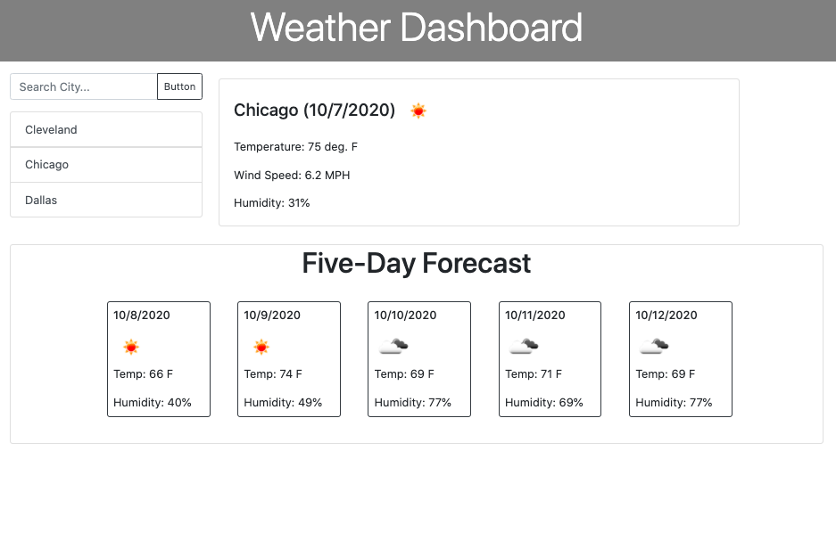

# Simple Weather

Developers are often tasked with retrieving data from another application's API and using it in the context of their own. Third-party APIs allow developers to access their data and functionality by making requests with specific parameters to a URL. Your challenge is to build a weather dashboard that will run in the browser and feature dynamically updated HTML and CSS.

## User Story

```
AS A traveler
I WANT to see the weather outlook for multiple cities
SO THAT I can plan a trip accordingly
```
## Demo of the Application

https://drive.google.com/file/d/1dfV1WeYhmMIHUyz_Pg_6sLWuydxCbIYe/view

## Access to the Application

You are required to submit the following for review:

* The URL of the deployed application.

https://andrewcircelli.github.io/SimpleWeather/

* The URL of the GitHub repository. Give the repository a unique name and include a README describing the project.

https://github.com/andrewcircelli/SimpleWeather

## Screenshots of the Application


